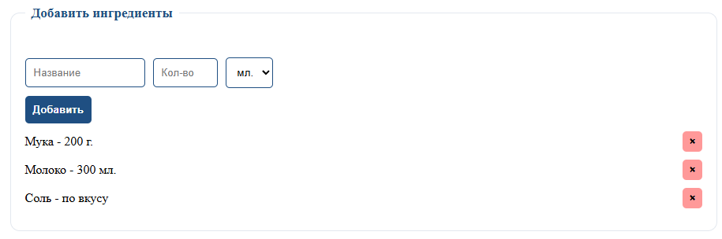
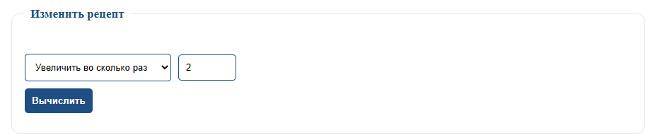
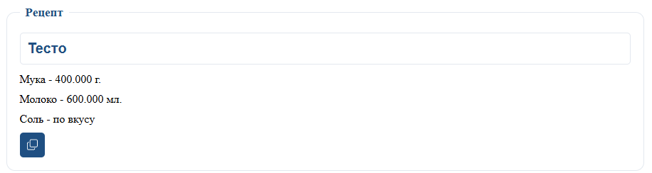

# Калькулятор ингредиентов для рецептов

Веб-приложение для быстрого пересчёта ингредиентов в рецепте. С помощью калькулятора можно увеличить или уменьшить количество продуктов в несколько раз и сразу получить готовый обновлённый рецепт.

## Описание

Приложение помогает не считать ингредиенты вручную. Пользователь добавляет продукты, указывает количество и единицу измерения, после чего выбирает: увеличить или уменьшить рецепт. Итоговый результат можно скопировать в буфер обмена и использовать в заметках, сообщениях или документах.

Если количество ингредиента не указано или равно нулю, приложение выводит значение «по вкусу».

## Возможности приложения

- добавление ингредиентов в список;
- выбор единиц измерения: граммы, килограммы, миллилитры, литры, чайные ложки, столовые ложки, штуки;
- удаление ингредиентов из списка;
- увеличение рецепта в заданное количество раз;
- уменьшение рецепта в заданное количество раз;
- ввод названия готового рецепта;
- копирование результата в буфер обмена;
- всплывающее уведомление после копирования;
- переключение светлой и тёмной темы;
- изменение размера текста;

## Как пользоваться

1. Введите название ингредиента, его количество и выберите единицу измерения. После этого нажмите кнопку **«Добавить»**.


2. Добавленные ингредиенты появятся в списке. При необходимости любой ингредиент можно удалить.



3. В блоке изменения рецепта выберите, нужно увеличить или уменьшить количество ингредиентов. Затем введите число, во сколько раз нужно изменить рецепт, и нажмите **«Вычислить»**.



4. В нижнем блоке появится готовый пересчитанный рецепт. Можно указать название рецепта и скопировать результат с помощью кнопки копирования.



## Дополнительные функции

В приложении есть несколько настроек для удобства:

- кнопки `+` и `-` позволяют изменить размер текста;
- кнопка с иконкой темы переключает светлый и тёмный режим;
- инструкция раскрывается плавно;
- при ошибке ввода предупреждение появляется рядом с нужным полем;
- после копирования появляется небольшое уведомление вместо стандартного окна браузера.

## Установка на смартфон

Приложение можно использовать как обычную веб-страницу или добавить его на главный экран смартфона.

1. Откройте приложение в браузере.
2. Нажмите на меню браузера.
3. Выберите пункт **«Добавить на главный экран»** или **«Установить приложение»**.
4. После этого значок приложения появится на рабочем столе телефона.

## Технологии

Проект выполнен на чистых веб-технологиях без дополнительных библиотек:

- HTML5;
- CSS3;
- JavaScript.

## Структура проекта

```text
calculator/
├── index.html
├── style.css
├── main.js
├── README.md
├── img/
│   ├── 01.png
│   ├── 02.png
│   ├── 03.png
│   └── 04.png
└── favicon/
    ├── favicon.ico
    ├── favicon.svg
    ├── favicon-96x96.png
    ├── apple-touch-icon.png
    └── site.webmanifest
```

## Запуск проекта

Для запуска не требуется установка зависимостей.

1. Скачайте проект.
2. Откройте папку проекта.
3. Запустите файл `index.html` в браузере.

## Пример работы

Исходный рецепт:

```text
Мука - 200 г.
Молоко - 300 мл.
Соль - по вкусу
```

Если увеличить рецепт в 2 раза, результат будет:

```text
Мука - 400 г.
Молоко - 600 мл.
Соль - по вкусу
```

## Автор

Разработчик: Терехов Владислав

## Связь с автором

Если вы нашли ошибку в работе приложения или хотите предложить улучшение, можно написать на почту:

```text
terehov2005@gmail.com
```

## Репозиторий

Код проекта доступен на GitHub:

```text
https://github.com/Terehov380/calc_ingredients
```
